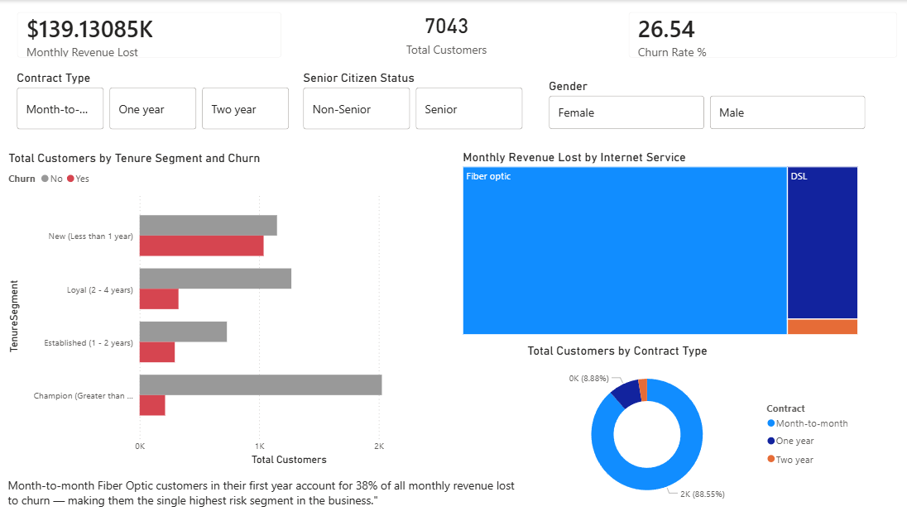
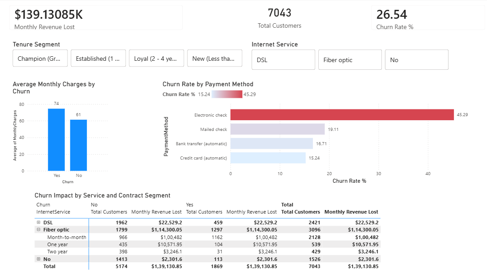

# Telco Customer Churn Analysis

## Overview
End-to-end data analysis project exploring customer churn patterns, 
revenue impact, and high-risk segments using SQL Server and Power BI.

## Tools
- SQL Server (SSMS)
- Power BI Desktop

## Key Finding
Month-to-month Fiber Optic customers in their first year account for 
38% of all monthly revenue lost to churn.

## Status
- [x] Data cleaning and validation
- [x] SQL analysis (15 queries)
- [ ] Power BI dashboard (in progress)
- [ ] Published dashboard link

## Files
- [SQL Analysis](sql/telco_churn_analysis.sql)
- [Power BI Dashboard](#) — link coming soon

## Power BI Dashboard
> [!TIP]
> View the live interactive dashboard [here](LINK_COMING_SOON).

  
Click to view Dashboard Screenshots

  
  ### Customer & Churn Overview
  
  
  ### Revenue & Payment Analysis
  
  

